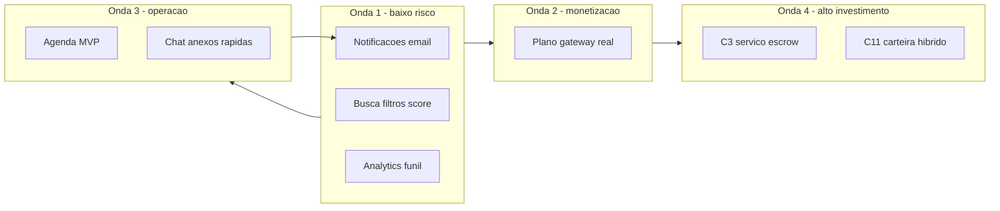

# Plano de novas features (implementáveis)

## Contexto rápido

O **ReparaTudo** já cobre fluxos centrais: auth (incluindo reset de senha), busca por serviço/raio, pedido direcionado, trabalhos abertos com propostas, chat WebSocket, avaliações, incidentes, KYC leve e audit log. O maior ganho agora está em **operar melhor** (notificações, agenda), **melhorar descoberta** (busca), **monetizar de verdade** (plano e, depois, serviço) e **aprofundar o chat**. A fonte de verdade quantitativa está em [docs/feature-value-verification.md](docs/feature-value-verification.md).

---

## Fase A — Alto retorno / esforço moderado (recomendado primeiro)

### A1. Notificações transacionais por e-mail (C1)

- **O quê:** disparar e-mails em eventos críticos: novo pedido, nova proposta, nova mensagem no chat, lembretes de agendamento (quando existir agenda).
- **Por quê:** reduz abandono e tempo até primeiro contato; base para lembretes da agenda.
- **Onde tocar:** serviço de e-mail já usado no reset ([apps/api](apps/api)); novos templates; possivelmente fila/cron ou envio assíncrono; preferências opt-in (LGPD).
- **Métrica:** primeiro contato em < 15 min após pedido/proposta; guarda: opt-out e spam reports.

### A2. Busca: ordenação combinada e filtros (C5)

- **O quê:** além de distância e `avgResponseMins`, combinar **distância, nota média, verificado, tempo de resposta** (score ou ordenação multi-critério) e filtros (ex.: só verificados, raio já existe).
- **Por quê:** hoje a ordenação é limitada; melhora conversão pós-busca.
- **Onde tocar:** [apps/api/src/presentation/http/routes/provider-search.ts](apps/api/src/presentation/http/routes/provider-search.ts) e repositório de busca; UI da listagem no web.
- **Esforço:** relativamente baixo (dados já existem em grande parte).

### A3. Instrumentação de produto / funil (C10)

- **O quê:** eventos mínimos (`signup_completed`, `request_created`, `open_job_created`, `quote_submitted`, `request_confirmed`, `chat_first_message`, `rating_submitted`) com ferramenta escolhida (ex. PostHog/GA) e política de privacidade alinhada à [Legal](apps/web/src/pages/Legal.tsx).
- **Por quê:** sem isso, priorizar C2 vs. C3 ou medir impacto de C1/C5 fica às cegas.
- **Dependência:** ideal **antes** de investir pesado em pagamento de serviço (C3/C11).

---

## Fase B — Monetização confiável (plano do prestador)

### B1. Pagamento real da assinatura de plano (C2)

- **O quê:** substituir PIX/cartão mockados em `provider_plan_payments` por gateway (Stripe, Pagar.me, Mercado Pago, etc.) com **webhooks**, idempotência e estados confiáveis.
- **Onde tocar:** [apps/api/src/infrastructure/persistence/init-db.ts](apps/api/src/infrastructure/persistence/init-db.ts) (já há estrutura), fluxo em perfil/pagamentos do prestador no web, [build-app.ts](apps/api/src/build-app.ts) para rotas de webhook.
- **Pré-requisito:** definição comercial do plano; ambiente de sandbox.

---

## Fase C — Operação e engajamento

### C1. Agenda em MVP (C4)

- **O quê:** prestador define janelas (dia + faixa); cliente sugere horário; prestador confirma; estados ligados ao pedido.
- **Por quê:** lacuna explícita; aumenta taxa de “horário combinado” e reduz atrito.
- **Dependência forte:** integra bem com **C1 (e-mails)** para lembretes.

### C2. Chat: anexos e respostas rápidas (C7)

- **O quê:** imagens no chat (storage — projeto já menciona padrão de upload/Cloudinary em outros fluxos), mensagens de sistema em marcos, 2–3 templates (“chego em X min”, etc.).
- **Onde tocar:** modelo `messages` hoje é texto único — exigirá migração/colunas ou JSON de metadados; [Chat.tsx](apps/web/src/pages/Chat.tsx) e rotas de mensagens na API.
- **Guarda:** limite de tamanho/tipo e moderação leve.

---

## Fase D — Novo produto / alto investimento (após clareza comercial)

### D1. Pagamento do serviço cliente ↔ prestador (C3)

- **O quê:** escrow ou registro forte de pagamento alinhado a estados do pedido, política de disputa, chargeback — não é só “ligar um PIX”.
- **Dependências:** KYC, suporte, definição de disputa; **C10** para validar demanda.

### D2. Carteira / repasse e modelo híbrido (C11)

- **O quê:** mensalidade + taxa por lead ou comissão; repasses — depende de **B1** e provavelmente de **D1**.

### D3. Catálogo e transparência (C6, C8, C9)

- **C6:** expandir [SERVICE_IDS](apps/api/src/domain/value-objects/service-id.ts) / categorias e checklist por serviço.
- **C8:** preços guia por serviço/região (curadoria manual no início).
- **C9:** checklist de materiais e campo de garantia simples no pedido.

---

## Ordem sugerida de implementação

1. **Paralelo:** A1 (notificações) + A2 (busca) — baixa dependência cruzada.
2. **Em seguida:** A3 (analytics) se ainda não existir, antes de gateway pesado.
3. **B1** (plano real).
4. **C1** (agenda) com lembretes via A1.
5. **C2** (chat aprofundado).
6. **D1/D2** quando houver decisão comercial e métricas de funil.

Este plano reutiliza priorização e métricas já documentadas na shortlist da seção 5 de [docs/feature-value-verification.md](docs/feature-value-verification.md) e evita duplicar trabalho já marcado como OK no inventário da seção 1 do mesmo arquivo.